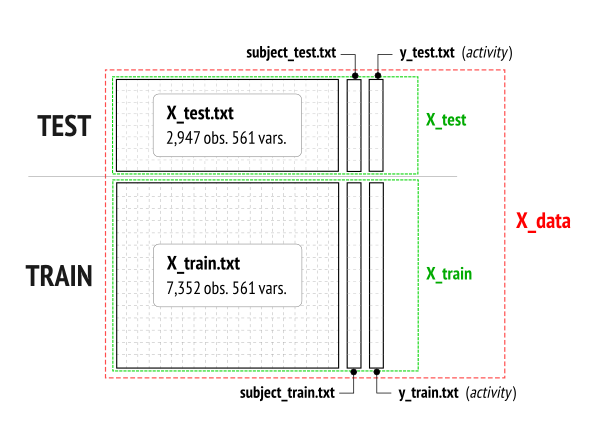

<br>
#Getting and Cleaning Data
### *Project Submission*

<!-- markdown-toc start - Don't edit this section. Run M-x markdown-toc/generate-toc again -->
**Table of Contents**

- [Getting and Cleaning Data](#getting-and-cleaning-data)
    - [-](#-)
    - [Introduction](#introduction)
        - [Requirements](#requirements)
        - [The Big Picture](#the-big-picture)
        - [Omiting files (:interrobang:)](#omiting-files-interrobang)
    - [Getting Raw Data](#getting-raw-data)
        - [Downloading files](#downloading-files)
        - [Files accommodation](#files-accommodation)
        - [Preliminary data inspection](#preliminary-data-inspection)
    - [Cleaning Data](#cleaning-data)
        - [Selecting features](#selecting-features)
        - [Selecting columns](#selecting-columns)
        - [Setting column names](#setting-column-names)
        - [Fetching variable names](#fetching-variable-names)
    - [Reading data](#reading-data)
        - [X_test](#X_test)
- [read data](#read-data)
- [set descriptive names](#set-descriptive-names)
- [read and add subject factor](#read-and-add-subject-factor)
- [read and add activity factor](#read-and-add-activity-factor)
- [add origin column](#add-origin-column)
    - [-](#-)
    - [Putting it all together](#putting-it-all-together)

<!-- markdown-toc end -->

<br>
## Introduction

This is my submission for the course project *Getting and Cleaning Data*
(<tt>getdata-006</tt>). I hope you enjoy my work, the way I've constructed
the dataset and the `R` code provided here to make it.

The file you are reading, `README.md`, contains exactly the same `R` code
than the script file `run_analysis.R` provided to make the assignment. Here
the ideas are developed and explained in great detail, whereas in the script
you'll find `R` comments with references to the steps followed all along the
work.

You can indistinctly run every single `R` in this file or run the script
file. The final result shall be the same.


### Requirements

`R` libraries used:

```R
library(data.table)
library(ggplot2)  # optional, in case you'd like to see some plots
```

### The Big Picture

First of all, I'd like to start by providing a *big picture* of the data
set. Of course, reading the documentation that comes with the *zip* file is a
big help to understand how to organize data.

After reading the documentation and with a simple examination of the files,
it's quite easy to figure out that the data files contained in the zip must
be organized as follows:

<center>

</center>

Each data block can be extracted from the files indicated in the figure,
although more will be used during the construction process.

Please note two unamed <span style="color:blue">*blue columns*</span> in the
figure. They correspond to a new factor variable I'll introduce later called
`origin`. The purpose of this variable is to keep track of the origin of each
row. Obvious possible values are `test` or `train`.


### Omiting files (:interrobang:)

I deliberately omit all files contained in the `test/Intertial Signals` and
`train/Intertial Signals` directories. The final dataset must contain only
those measurements on the mean and standard deviation for each measurement,
and neither of these directories contains such data. All measurements there
correspond to body acceleration, gyroscope and total acceleration, so there's
no need to worry about them.


<br>
## Getting Raw Data

Let's begin by the beginning.


### Downloading files

The very first thing to do is to download the zip file from the given URL:

```R
fileUrl <- "https://d396qusza40orc.cloudfront.net/getdata%2Fprojectfiles%2FUCI%20HAR%20Dataset.zip"
download.file(fileUrl, destfile="dataset.zip", method="curl")

```


### Files accommodation

I prefer to work with *unzipped* files both for reading from `R` and for
taking a look at them:

```R
unzip("dataset.zip")
```

I prefer short directory names and without spaces, for short and for ease of
use. For this `file.rename` comes in handy:

```R
file.rename("UCI HAR Dataset", "data")
```

These commands result in the following directory structure populated with
files:

```
                                              Used to extract
data/                                         -----------------------------
  ├── activity_labels.txt ................... metadata: activity names
  ├── features_info.txt
  ├── features.txt .......................... metadata: measure names
  ├── README.txt
  ├── test/
  │   ├── Inertial Signals
  │   │   ├── body_acc_x_test.txt
  │   │   :
  │   │   └── total_acc_z_test.txt
  │   ├── subject_test.txt .................. data: test: subject factor
  │   ├── X_test.txt ........................ data: test: observations
  │   └── y_test.txt ........................ data: test: activity factor
  └── train/
      ├── Inertial Signals
      ├── body_acc_x_train.txt
      │   :
      │   └── total_acc_z_train.txt
      ├── subject_train.txt ................. data: train: subject factor
      ├── X_train.txt ....................... data: train: observations
      └── y_train.txt ....................... data: train: activity factor

4 directories, 28 files
```


### Preliminary data inspection

Just to test reading few lines from `X_test.txt` and to check the number of
columns:

```R
> X_test.head <- data.table(read.table("data/test/X_test.txt", nrows=10))
> ncol(X_test.head)
[1] 561
```


<br>
## Cleaning Data

`X_test.txt` and `X_train.txt` are huge files. They contain 561 variables for
a total of 10,561 observations. According to the assignment specifications,
only 66 variables are needed (see below).

It's a clear waste of time and memory to read these two files in its
whole. It's better to use the `read.table` function to skip unneeded
columns. But for that, first it's crucial to know which are those *unneeded
columns*.

The plan is:

   + read the file `features.txt`
   + select those measurements matching *mean* and *std*
   + create a vector of factors to select columns, to be used by `read.table`


### Selecting features

The file `features.txt` contains the names of the measures following a simple
convetion. For example, some measures related to body acceleration `BodyAcc`
are named as follows:

| pefix | feature | suffix | axis    |
|:-----:|---------|--------|---------|
| t     | BodyAcc | energy | X, Y, Z |
| t     | BodyAcc | mean   | X, Y, Z |
| t     | BodyAcc | std    | X, Y, Z |
| t     | BodyAcc | sma    |         |

When `X`, `Y` and `Z` axis are present, there is a single feature for each
one.

We are only interested in names matching `mean` and `std`.

**Caution**: some variables also contain `mean` and `std` but aren't on the
mean or standard deviation of measures. For example, variables like:

   + `angle(tBodyAccMean,gravity)`
   + `angle(tBodyAccJerkMean),gravityMean)`
   + `angle(X,gravityMean)`

refer to *angles between* forces, not means. The same for variables like:

   + `fBodyAcc-meanFreq()-X`
   + `fBodyGyro-meanFreq()-X`
   + `fBodyBodyAccJerkMag-meanFreq()`

which are the *weighted average of the frequency components to obtain a mean
frequency*. Their *mean* counterpart already exist:

   + `fBodyAcc-mean()-X`
   + `fBodyGyro-mean()-X`
   + `fBodyBodyAccJerkMag-mean()`


```R
features <- read.table("data/features.txt", colClasses=c("NULL", NA))
features.idx <- grep("(mean|std)\\(", features[,1])
```

Variable `features.idx` contain the index of the target columns. Remaining ones must be dropped. How many columns are there?

```R
length(features.idx)
[1] 66
```

### Selecting columns

`read.table` function accepts a parameter called `colClasses` to indicate the
class of each column. It is possible to indicate `"NULL"` to skip columns and
`NA` (the default) to automatically use `type.convert`. With this, the vector
to select columns is:

```R
columnSelection <- rep("NULL", 561)
columnSelection[features.idx] = NA
```

### Setting column names

Now it's time to set proper, descriptive names to recently read columns in
`X_test`:

```R
names(X_test) <- features.names
```

### Fetching variable names

This step is crucial to select the columns to be read from `X_test.txt` and
`X_train.txt` files.


<br>
## Reading data

Now it's time to read `X_test` and `X_train` to create `X_data`.

### X_test

Few steps are needed to create `X_test`

   1. Read data columns
   2. Assign descriptive names to columns
   3. Read `subject` and `activity` factors
   4. Add them to `X_test`
   5. Add `origin` column

In `R` language:

```R
  # read data
  X_test <- data.table(read.table("data/test/X_test.txt", colClasses=columnSelection))

  # set descriptive names
  setnames(X_test, features.name)

  # read and add subject factor
  X_test.subject <- read.table("data/test/subject_test.txt")
  X_test[,subject:=as.factor(X_test.subject[,1])]

  # read and add activity factor
  X_test.activity <- read.table("data/test/y_test.txt")
  X_test[,activity:=activityName[X_test.activity[,1],2]]

  # add origin column
  X_test[,origin:="test"]
```


### X_train

This is the same as in `X_test`:

```R
```


<br>
## Putting it all together

<!--
Local Variables:
mode: markdown
mode: flyspell
End:
-->
